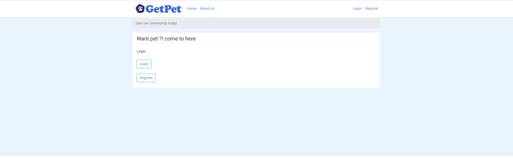

# flast-Python-proj
Python and Flask based website as a social network for people with animals looking for foster care named:

GetPet

This project was created for the course "Fundamentals of Software Engineering" Sami Shimon Academic College.

------Contributors-------
Tal Haimovich
Mor Merkrebs
Ortal Nosik
Asif Eretz-Kdosha

-------Setup & Installtion-------
Make sure you have the latest version of Python installed.
pip install instructions

------Instructions--------
you should install flask framework(use terminal and install via pip)
you will need to install the further add-ons for flask:
Flask==2.0.2
Flask-Bcrypt==0.7.1
Flask-Login==0.5.0
Flask-SQLAlchemy==2.5.1
Flask-WTF==1.0.0
email-validator==1.1.3
bcrypt==3.1.4
certifi==2016.2.28
cffi==1.11.5
click==6.7
itsdangerous==0.24
Jinja2==2.10
MarkupSafe==1.0
pycparser==2.18
six==1.11.0
SQLAlchemy==1.2.7
Werkzeug==0.14.1
WTForms==2.1
for the unittest:
flask_testing==1.0
blinker==1.4
pytest==1.0

-----Data Base Instructions------
The data base will be created automaticly when running the project for the first time(or if the data base file has been deleted)
-Note: if you change data-baswe related objects and attributs you shuld recreate the data-base file

------Run Program--------
to run the project please run "run.py" file in the main folder of the project

------Viewing The App------
Go to http://127.0.0.1:5000

------pov------

